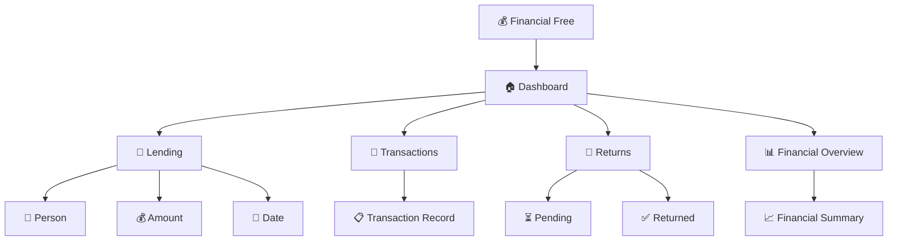

<div align="center">

# 💰 Financial Free

### ✨ Personal Finance & Lending Tracker


### 🚀 Track Money • Manage Lending • Monitor Returns

<br/>

<a href="https://financial-free-bay.vercel.app/">
  
</a>

<br/><br/>

<a href="#-demo-video">
  
</a>

</div>

---

## 🌟 About

**Financial Free** is a modern personal finance and lending tracker designed to help users organize money records, lending activity, repayments, and expected returns in one convenient interface.

The goal is simple:

> **Make personal financial tracking easier, clearer, and more organized.**

---

# 🎬 Demo Videos

<div align="center">

## 🎥 Financial Free — Video Showcase

### ▶️ Demo Video 01

<a href="https://www.instagram.com/reel/DdOLdHCymgv/?stkn=amRoeTk3eHk3bGw3">


</a>

**▶️ Watch Demo 01**

---

### ▶️ Demo Video 02

<a href="https://www.instagram.com/reel/DdHCsaIyYmK/?stkn=MTR4cjM5MHU5d2pwZg%3D%3D">


</a>

**▶️ Watch Demo 02**

</div>

---

## ✨ Animated Application Showcase

Add a GIF/WebP screen recording to:

```text
screenshots/
├── video-01-thumbnail.png
├── video-02-thumbnail.png
└── financial-free-demo.gif
```

Then display the animation:

<div align="center">


</div>

### 🎞️ Recommended README Showcase

```text
💰 FINANCIAL FREE
        ↓
✨ Animated Logo
        ↓
🎬 Demo Video 01
        ↓
🎬 Demo Video 02
        ↓
📱 Mobile Screens
        ↓
💻 Desktop Screens
        ↓
🚀 Features
        ↓
🛠️ Technology
        ↓
👨‍💻 Developer
```

> GitHub README files don't reliably support autoplaying Instagram/MP4 videos directly. Using a clickable thumbnail for each Reel plus a GIF/WebP for the animated preview provides a more reliable GitHub presentation.


### 📹 Add your video

Upload your demo video to YouTube or another video-hosting service and replace:

```text
YOUR_YOUTUBE_VIDEO_URL
```

with your actual video URL.

Recommended demo sequence:

```text
01  Opening Animation
        ↓
02  Dashboard
        ↓
03  Add Lending Record
        ↓
04  Transaction Details
        ↓
05  Return Tracking
        ↓
06  Financial Overview
        ↓
07  Mobile Responsive View
        ↓
08  Final Logo Animation
```

---

# ✨ Animated Preview

You can add an animated GIF/WebP showing the application:

<div align="center">


</div>

### Recommended animation

```text
Dashboard
   ↓
Smooth Card Entrance
   ↓
Financial Numbers Animate
   ↓
Navigation Transition
   ↓
Lending Screen
   ↓
Return Tracking
   ↓
Analytics
   ↓
Mobile View
```

---

# 🚀 Features

<div align="center">

|    💰 Lending    |     🔄 Returns     |    📊 Dashboard    |
| :--------------: | :----------------: | :----------------: |
| Track money lent | Monitor repayments | Financial overview |

|       📝 Records       |  📱 Responsive  |   🎨 Modern UI   |
| :--------------------: | :-------------: | :--------------: |
| Organized transactions | Phone & desktop | Smooth interface |

</div>

---

## 💸 Lending Tracker

Keep records of money that you lend to other people.

```text
Person
   ↓
Amount
   ↓
Date
   ↓
Transaction
   ↓
Expected Return
```

---

## 🔄 Return Tracking

Monitor money that is expected to come back.

The interface can help users distinguish between:

```text
💰 Total Lent
     ↓
🔄 Returned
     ↓
⏳ Pending
     ↓
📊 Remaining
```

---

# 🎨 UI & Animation

Financial Free is designed around a smooth and modern interface.

### ✨ Animation System

```text
┌──────────────────────────────┐
│       FINANCIAL FREE         │
│                              │
│   ✨ Fade In                 │
│   ↗️ Slide Up                │
│   💫 Scale In                │
│   🔄 Smooth Transition       │
│   📊 Number Animation         │
│   🖱️ Hover Effects            │
│   📱 Responsive Motion        │
└──────────────────────────────┘
```

### Recommended visual effects

* Smooth page transitions
* Card entrance animations
* Number/count-up animations
* Button hover animations
* Soft shadows
* Glass-style cards
* Smooth navigation
* Interactive charts
* Responsive transitions
* Micro-interactions
* Loading animations

---

# 🖼️ Screenshots

Store screenshots inside:

```text
screenshots/
├── dashboard.png
├── lending.png
├── transactions.png
├── returns.png
├── analytics.png
├── mobile.png
└── video-thumbnail.png
```

# 🏠 Dashboard

<div align="center">

### ✨ Your Money. Your Records. One Beautiful Dashboard.

**A simple and modern financial workspace designed to give you a clear view of your lending and return activity.**


</div>

---

## 💎 Everything at a Glance

Financial Free brings your important financial information together in one clean dashboard.

### 💰 Money Overview

Quickly understand the money you've recorded and the current status of your financial activity.

### 💸 Lending Activity

See your lending records in an organized and easy-to-read experience.

### 🔄 Return Progress

Keep track of expected returns and repayment activity.

### 📊 Financial Insights

Turn your records into a simple overview that helps you understand your activity.

---

# ✨ A Dashboard Built to Feel Simple

> **Less confusion. More clarity.**

The dashboard is designed around a simple principle:

```text
                    💰 YOUR MONEY
                         │
          ┌──────────────┼──────────────┐
          │              │              │
          ▼              ▼              ▼
       💸 LENT        🔄 RETURNED      ⏳ PENDING
          │              │              │
          └──────────────┼──────────────┘
                         ▼
                   📊 OVERVIEW
```

---

# 🎨 Beautiful by Design

Financial Free combines useful financial information with a clean modern interface.

✨ Smooth visual transitions
💎 Modern cards
📊 Clear financial information
📱 Responsive layouts
🖱️ Interactive elements
🌊 Smooth navigation
⚡ Fast and focused experience

---

# 🚀 Explore Financial Free

<div align="center">

### 💰 Track

**Keep your lending records organized.**

### 🔄 Monitor

**Follow your return and repayment activity.**

### 📊 Understand

**See your financial activity through a clear overview.**

### ✨ Experience

**Explore everything through a modern interface.**

<br/>

<a href="https://financial-free-bay.vercel.app/">


</a>

</div>

---

# 🎬 See It in Action

<div align="center">

### 🎥 Real Application Showcase

<a href="YOUR_INSTAGRAM_REEL_1_URL">

**▶️ Watch Dashboard Showcase — Video 01**

</a>

<br/><br/>

<a href="YOUR_INSTAGRAM_REEL_2_URL">

**▶️ Watch Application Showcase — Video 02**

</a>

</div>

---

#

### 💸 Lending

<div align="center">


</div>

---

### 🔄 Returns

<div align="center">


</div>

---

### 📱 Mobile Experience

<div align="center">


</div>

---

# 🧭 Application Flow



---

# 📱 Responsive Experience

Financial Free is designed to adapt to different screen sizes.

```text
        📱 Mobile
           ↓
      ┌───────────┐
      │ Financial │
      │   Free    │
      └───────────┘

          ↕️

       📲 Tablet
          ↓
   ┌─────────────────┐
   │   Financial     │
   │      Free       │
   └─────────────────┘

          ↕️

       💻 Desktop
          ↓
┌──────────────────────────────┐
│        Financial Free        │
│                              │
│ Dashboard | Records | Stats  │
└──────────────────────────────┘
```

---

# 🛠️ Technology

Add the exact technologies used by your source code here.

Example:

<div align="center">


</div>

---

# 📂 Project Structure

```text
financial-free/
│
├── public/
│   ├── assets/
│   ├── icons/
│   └── screenshots/
│
├── src/
│   ├── components/
│   ├── pages/
│   ├── hooks/
│   ├── lib/
│   ├── utils/
│   └── styles/
│
├── screenshots/
│   ├── dashboard.png
│   ├── lending.png
│   ├── transactions.png
│   ├── returns.png
│   ├── analytics.png
│   ├── mobile.png
│   ├── video-thumbnail.png
│   └── financial-free-demo.gif
│
├── README.md
├── package.json
└── LICENSE
```

---

# 💻 Run Locally

### Clone

```bash
git clone YOUR_REPOSITORY_URL
```

### Enter project

```bash
cd financial-free
```

### Install dependencies

```bash
npm install
```

### Start development server

```bash
npm run dev
```

Open:

```text
http://localhost:5173
```

---

# 🔐 Security

Never commit sensitive information.

```text
.env
.env.local
API keys
Private tokens
Passwords
Real financial records
```

Use environment variables for private configuration.

---

# 🔮 Future Improvements

```text
🔔 Repayment Notifications
📅 Due Date Reminders
📊 Advanced Analytics
📈 Monthly Reports
📆 Yearly Reports
📄 PDF Reports
📤 CSV Export
🔎 Advanced Search
🏷️ Categories
👤 Contact Management
🌙 Dark Mode
☁️ Cloud Synchronization
🔐 Advanced Authentication
📱 Improved Mobile Experience
```

---

# 👨‍💻 Developer

<div align="center">

## Shaik Zakeer

**AI Developer • AI Content Creator • Student**

Building modern web applications and experimenting with AI-powered technology.

</div>

---

# 🌐 Links

<div align="center">

### 🚀 Live Application

<a href="https://financial-free-bay.vercel.app/">


</a>

</div>

---

# ⭐ Support

If you find **Financial Free** useful:

⭐ Star the repository
🍴 Fork the project
🐛 Report bugs
💡 Share suggestions

---

<div align="center">


### 💰 Financial Free

**Track • Organize • Understand**

Made with ❤️ by **Shaik Zakeer**

</div>
